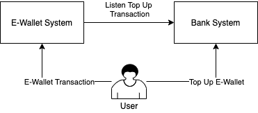
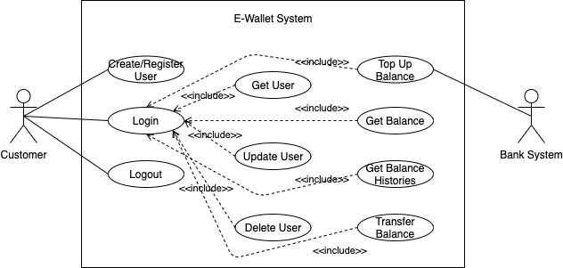
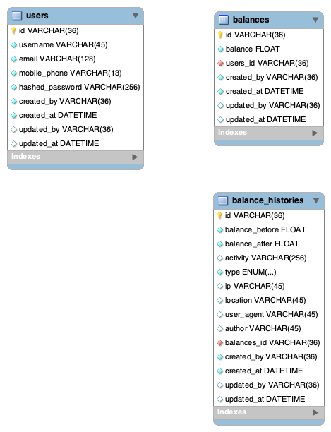

# E-Wallet Example

Table of content:
1. Description
2. System Design
3. Create Container
4. Testing Using Insomnia
---

## Description
E-Wallet is a system used to store money balances but not real money and use it to facilitate online transactions. In this repository two systems will be distinguished, E-Wallet system and Bank system. E-Wallet system will not record any transactions from bank, vice versa. Users who will make transactions using E-Wallet must register to the system and top up balance through the bank system.



## System Design

### Usecase Diagram

 
 [See the details](docs/USECASE.md)

### Database Design


## Create Container
1. Copy .env.docker.example to .env then edit the content based on your preferred configuration
2. Run docker-compose.yaml
```
docker-compose up --build -d
```
3. Open http://localhost:8080
4. Run migration in container
```
docker-compose exec api go run script/run_migration/run_migration.go
```
5. Run seeder in container
```
docker-compose exec api go run script/run_seed/run_seed.go
```

## Testing using Insomnia
1. Import Insomnia.json to your Insomnia app
2. Change Environment based on your preference